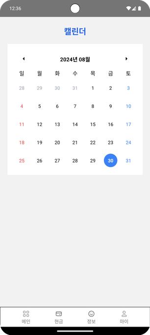
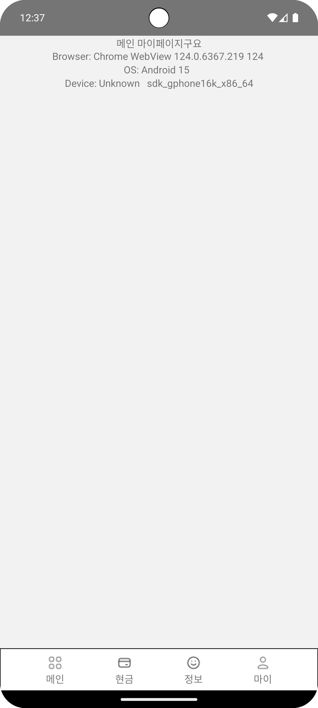

# 현금 챌린지 Notion 작성
[기획 아이디어 - 현금 챌린지 (Notion)](https://ssafy-study-daejeon-class4.notion.site/5a64edef4ef24d53b7236660c8b9f8cd)

## 구체화 - 김범규

**1. 현금 챌린지 + 데일리 금융 관련 퀴즈
- 돈 관리를 하는 만큼, 금융에 대한 지식을 얻으면 좋을 것 같아 구상
- 매일 매일 금융과 관련된 주제 중 하나를 선정하여 문제를 출제 하여 정보를 제공
- 맞추면 Pass, 틀릴 시 정보를 제공하여 사용자가 금융 관련 지식을 간단하게라도 함양할 수 있도록 하는 것이 목표

## 개인적으로 공부한 내용
**1. 앱 개발을 할 수도 있기 때문에, React Native 환경에서 나중에 프로젝트에서 사용할 수 있을만한 기능들을 중심으로 기본 작업을 실시하였음. 
- 언더바 제작
- 캘린더 기능 (react-native-calendars)
- UA 정보 불러오기 (ua-parser-js)

**2. Android Studio를 다운로드 하여, Emulator를 설정하고 이를 React Native와 연동하는 작업 실시(환경 변수 설정, 나중에 시연 시 버전에 맞는 휴대폰에 맞추기 위해 기기 설정)

**3. 공지사항에 있는 금융 API 명세서를 읽어보며, 전체적인 흐름에 대해 공부하고자 하였음

